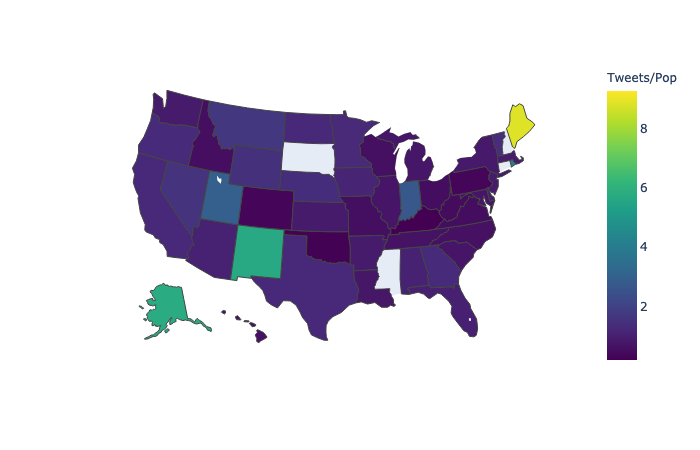

### [Home](../../index.md) | [Contact](../../contact.md) 

# Fuzzy Geocoding on Tweets

_From a Friday afternoon project on geocoding Twitter-user bios. The results aren't near 
ready for prime time but were also worth documenting._

Fig. 1: Tweets per state (determined by fuzzy geocoding) over state population (2012 Census).

When analyzing social media data we often want to add a geographic element to the activity. 
This isn't always so easy due to data availability and user practices with location disclosure. 
Here I run over some preliminary results from my first experience with attempting fuzzy-string geocoding 
on Twitter-users' self-disclosed location strings. 

There are a couple ways to go about gettiing geographic data for Twitter.
When looking at Tweets,
the easiest case is obviously when the user enables geolocation and precise(ish) coordinates are available for the activity.
This has its limitations, especially in more recent years (~2015+) where changes to Twitter defaults have left very
few accounts with geolocation enabled (there are also concerns about the types of accounts likely to enable this feature).
At one point I found less than 1% of tweets in our random 10% sample had precise geolocation information available. 

There have been other approaches proposed such as looking at the content of tweets to infer location. 
Others have used propogated location information across the social network in order to fill in missing
geographic data [[1]](https://ojs.aaai.org/index.php/ICWSM/article/view/14399).

Another approach involves fuzzy string matching in order to geocode
the location string in user bios. 
For this work I was focused on the US, although I don't filter the tweets (by language, etc.) before
geocoding. 
Some colleagues had used the python library [uszipcode](https://uszipcode.readthedocs.io/)[2] with varying degrees
of success for specific projects, and I was curious what would happen if we ran a sample from our 10% historical Twitter feed through the fuzzy geocoding process.
The library provides a convenient search engine for matching strings for cities and states with agaisnt known regions. 
Using regular expressions I extracted user bios that roughly fit templates such as `city, state`, `city, state, country`, etc.

I cross-referenced the results of the geocoding with data from the 2012 US Census to get a sense where our method
was under or overcounting, at least relative to known state populations. 
Of course, comparing Twitter users (even if the geocoding was perfectly accurate) to state population is 
a bit of funny comparison to make, but it was largely meant as a reference point. 

Fig. 2: Comparison of geocoded US Twitter bio locations with 2012 US Census.

After filtering out creative uses of emoji tuning the regular expression, the pipeline produces results that in some cases
match what we'd expect based on state population data, and in others is clearly off. 
For instance, California has both the largest tweeting population (by our measure) and is the most populous state. 
Indiana on the other hand is really hitting above its weight when to comes to tweeting population---I determined this was because
the geocoding library incorrectly coded strings related to India to Indiana, leading to significant inflation of the results for the state. 
Washington, DC is a special case where geocoding seems to be somewhat unstable, but there may also be a disproportionate number 
if users setting the district as their location given its large political crowd and number of commuters from surrounding states. 

#### References 
[1] https://ojs.aaai.org/index.php/ICWSM/article/view/14399

[2] https://uszipcode.readthedocs.io/
